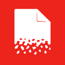

#  Universal Cleaner
A Chrome extension for deleting all Local Storage, Session Storage and Cookies by one click.

## How to install
* Download all data from this repository somwhere on your local drive
* Browse to `chrome://extensions/` and enable developer mode in the top right corner
* Klick on the newly added button on the top left "load unpacked extensions" and choose the folder where these files are in
* Enable the Universal Cleaner extension from the list below

## How to use
* When activated, you will find a new tab under the development tools that is called `Cleaner`
* Under the tab you will find buttons for deleting ALL Data (Local Storage, Session Storage, Cookies) from your currently visited page
* If you want to delete only one storage or only the cookies there are buttons for that as well.

ENJOY!
